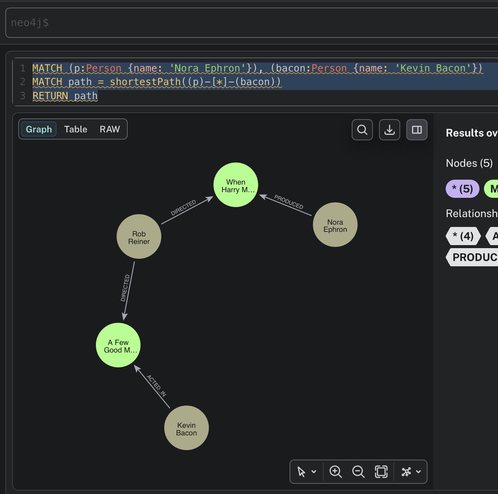
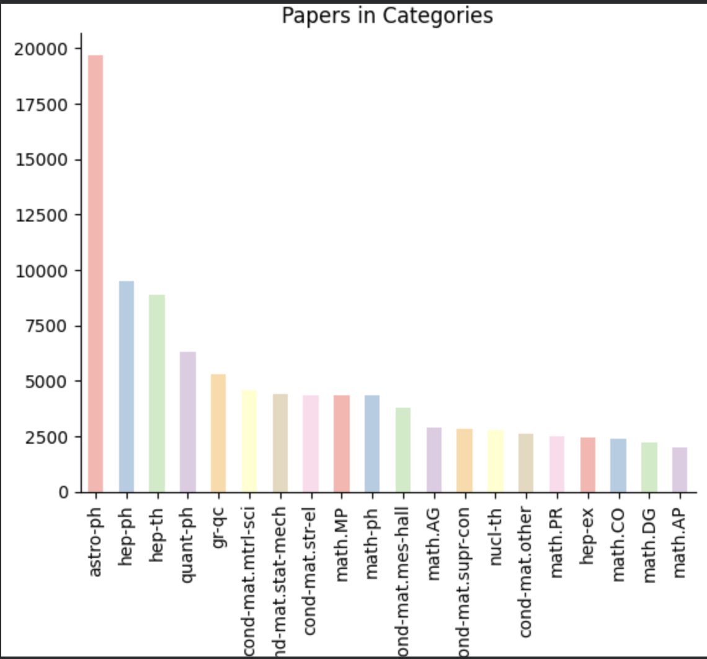
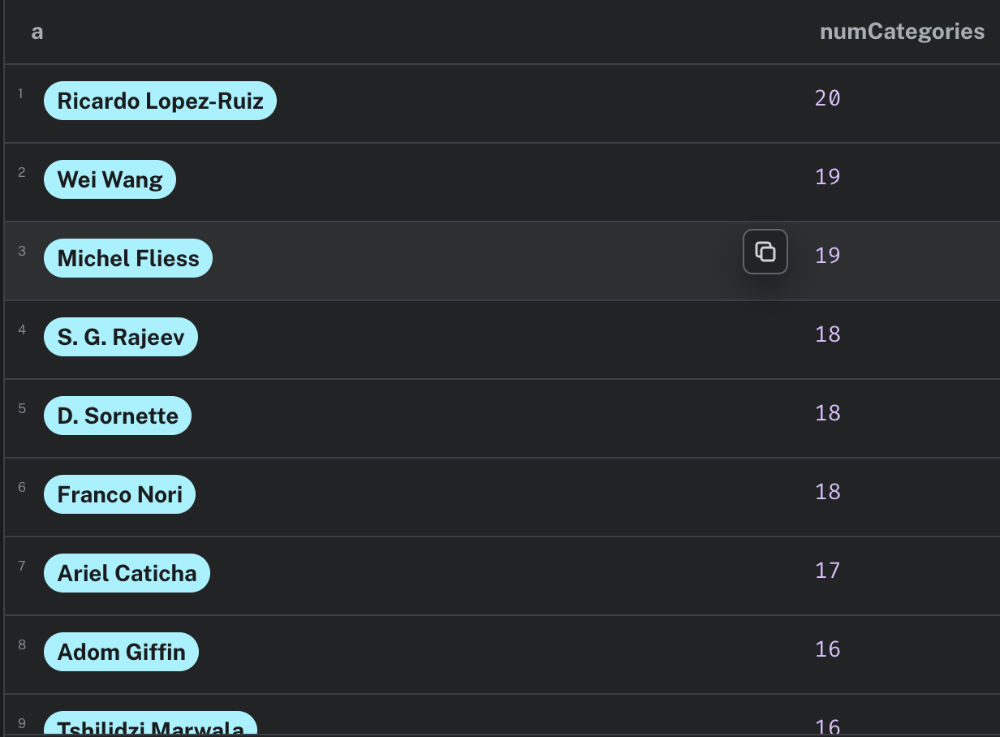
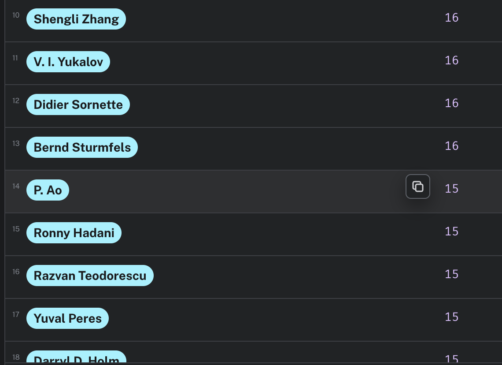
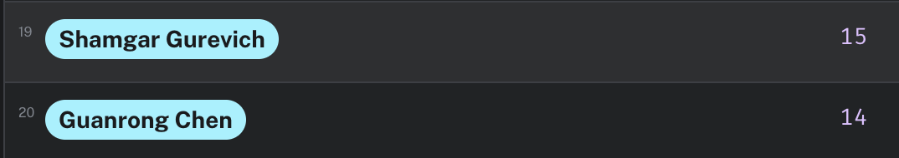

# graphDB

Home for neo4j

## 1.



## 2.



## 3.

5812 total different papers in cs returned

## 4.

Query used:

```
MATCH (p: Paper)-[:IN_CATEGORY]->(c:Category)
WHERE c.category STARTS WITH "cs"
RETURN count(DISTINCT p)
```

I counted all unique papers. When counting each time a paper appeared in a category (done by just removing the DISTINCT), there were a couple thousand more entries.

## 5.

I wrote this query to find the authors writing across the most different categories:

```
MATCH (a:Author)-[:AUTHORED]->(p:Paper)-[:IN_CATEGORY]->(c:Category)
RETURN a, COUNT(DISTINCT c) AS numCategories
ORDER BY numCategories DESC
LIMIT 20
```

This returned the following data. Ricardo has gotta calm down



